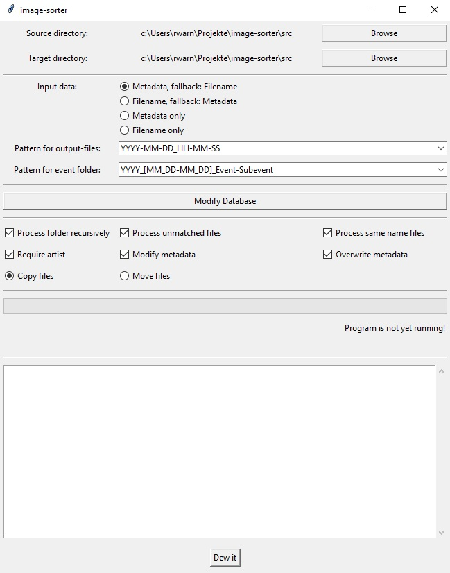

# Image Sorter

## Description
This is a small python application to sort images into folder.
For the sorting proccess either the image name or the image meta data can be used.
All functionalities are accesseable via a simple GUI.

## Table of Contents
1. [Installation](#installation)
2. [Usage](#usage)
3. [Contributing](#contributing)
4. [Credits](#credits)
4. [License](#license)

## Installation

1. install Python
2. install Anaconda or similar
3. install npm
4. download repository
5. open console in repository folder
6. run `npm init`
7. run `pip install < requirements.txt`
8. start by TODO

### Dependencies

#### Need to be installed
* [tkinter](https://docs.python.org/3/library/tkinter.html) for the interface/GUI
* [tkcalendar](https://pypi.org/project/tkcalendar/) for the date selection
* [Pillow (PIL)](https://pillow.readthedocs.io/en/stable/#) for reading the image metadata (EXIF)
* [piexif](https://piexif.readthedocs.io/en/latest/) for modification of the image metadata (EXIF)

#### Standard
* [datetime](https://docs.python.org/3/library/datetime.html) for all time data objects
* [re (regex)](https://docs.python.org/3/library/re.html) for parsing file names
* [sqlite3](https://docs.python.org/3/library/sqlite3.html) for the database
* [json](https://docs.python.org/3/library/json.html) for event loading and saving
* [threading](https://docs.python.org/3/library/threading.html) used such that the gui is not freezed while processing,
  [Details](https://realpython.com/intro-to-python-threading/)

## Usage
TODO

## Contributing

I encourage you to contribute to this project, in form of bug reports, feature requests
or code additions. Although it is likely that your contribution will not be implemented.

Please check out the [contribution](docs/CONTRIBUTING.md) guide for guidelines about how to proceed
as well as a styleguide.

## Credits
Up until now there are no further contributors other than the repository creator.

## License
This project is licensed under the MIT License
